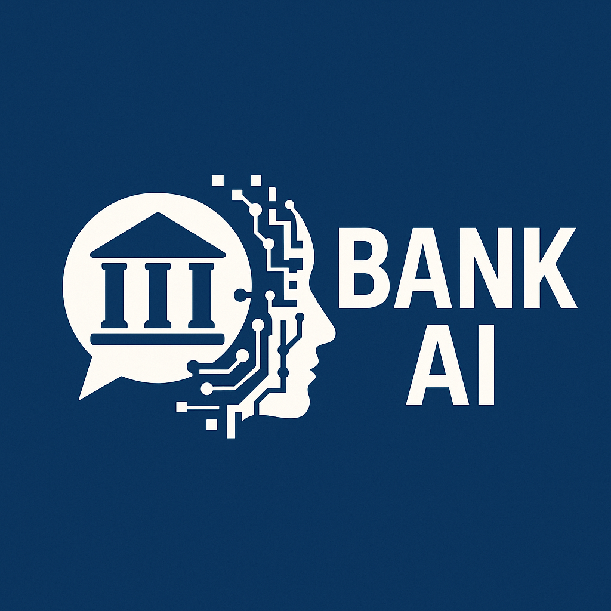

# BankVisionAI
A modern, user-friendly banking portal that allows bank employees to quickly access customer information using natural language queries powered by Google Gemini AI.

BankVision: AI-Powered Banking Assistant
✨ Enhanced UI & Features for Bank Staff
A modern, user-friendly banking portal that allows bank employees to quickly access customer information using natural language queries powered by Google Gemini AI.

🚀 Key Features
✅ Natural Language Search – Ask in plain English (e.g., "Show Arun Kumar from Palakkad branch")
✅ Instant Customer & Transaction Lookup – View balances, transactions, and account details
✅ Beautiful & Intuitive UI – Designed for non-technical bank staff
✅ Sample Data Generator – Quickly populate the database with realistic demo data
✅ Responsive Design – Works on desktops, tablets, and mobile

# BankVision: AI-Powered Banking Assistant 🏦✨



A modern, user-friendly banking portal that allows bank employees to quickly access customer information using **natural language queries** powered by Google Gemini AI.

## 🌟 Key Features
- **🔍 Natural Language Search**  
  Ask in plain English (e.g., _"Show Arun Kumar from Palakkad branch"_)
- **💳 Instant Customer & Transaction Lookup**  
  View balances, transactions, and account details in one click
- **🎨 Beautiful & Intuitive UI**  
  Designed specifically for non-technical bank staff
- **🔄 Sample Data Generator**  
  Populate the database with realistic demo data instantly
- **📱 Responsive Design**  
  Works flawlessly on desktops, tablets, and mobile devices

## 🏗 Project Structure
BankVision/
├── static/
│ ├── css/
│ │ └── style.css # Custom styles
│ ├── js/
│ │ └── script.js # Interactive elements
│ └── images/ # Assets
│ ├── logo.png
│ └── bg-wave.svg
├── templates/
│ ├── base.html # Main layout
│ ├── dashboard.html # Search interface
│ ├── customer.html # Single customer view
│ ├── customers_list.html # Multi-customer view
│ └── transactions.html # Transaction history
├── app.py # Flask backend
├── database.py # DB operations
├── gemini.py # AI integration
├── requirements.txt # Dependencies
└── README.md # Documentation

Copy

## 🛠 Tech Stack
| Component       | Technology Used          |
|-----------------|--------------------------|
| **Backend**     | Python (Flask)           |
| **Database**    | PostgreSQL (Supabase)    |
| **AI Engine**   | Google Gemini API        |
| **Frontend**    | Bootstrap 5 + Custom CSS |
| **Deployment**  | Render/Vercel (Optional) |

## 🚀 Quick Start
1. Clone the repository:
   ```bash
   git clone https://github.com/yourusername/BankVision.git
   cd BankVision
2. Install dependencies:

  ```bash
  pip install -r requirements.txt
  ```
DEMO"""

**Introductory page:**


**Showing customer details from a  particular branch:**


**Showing all transactions of john morales**


**Show Last 5 transactions of Alex Lund**


**Demonstration of customer details**


_________________________________________________________
Frontend	HTML5, CSS3, Bootstrap 5
Deployment	(Optional: Render, Vercel, AWS)

